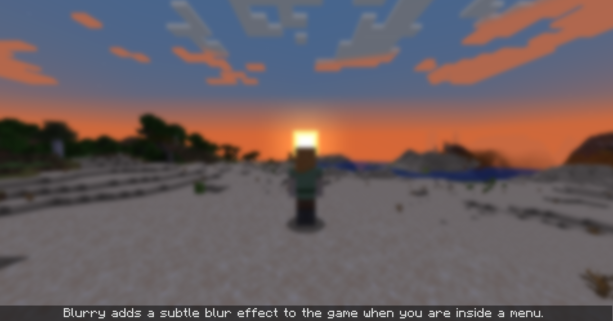

<h1 align="center">Blurry.</h1>

<p align="center">A 1.19.2+ Fabric Mod by <a href="https://github.com/Draylar">Draylar</a></p>

---



---

<h3 align="center">⚙ Configuration</h4>

<p align="center">When the blur needs to be tweaked...</p>

```json5
// Configuration is located in the /config/blurry.json5 file

{
  //The speed blur progresses at each tick. Higher is faster.
  "blurSpeed": 0.15
}
```

---

<h3 align="center">⚖ License & Usage</h4>

<p align="center">Can I steal it?</p>

Blurry is available under the MIT license. 
You can use anything in this repository as long as any major reproduced code snippets are accompanied by a copy of the LICENSE text.

The underlying blur algorithm is called _Kawase Blur_, and was presented by Masaki Kawase in a 2003 GDC talk.
Kawase blur offers similar quality to gaussian with a lower performance cost.
You can find more information on the algorithm [here](https://blog.en.uwa4d.com/2022/09/01/screen-post-processing-effects-chapter-4-kawase-blur-and-its-implementation/).